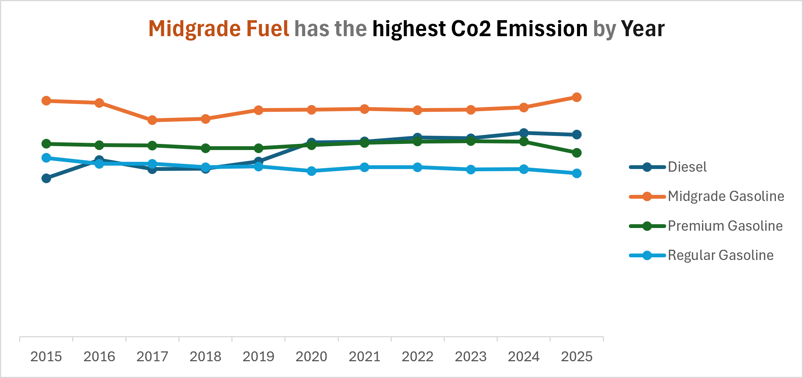
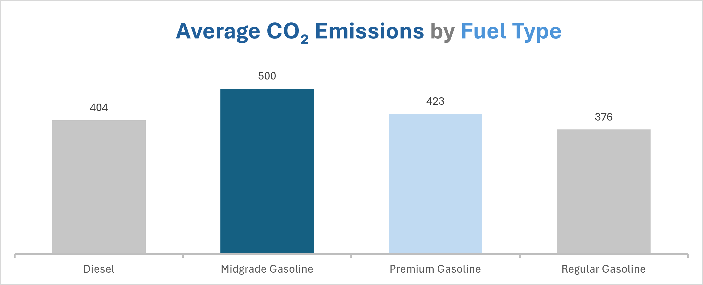
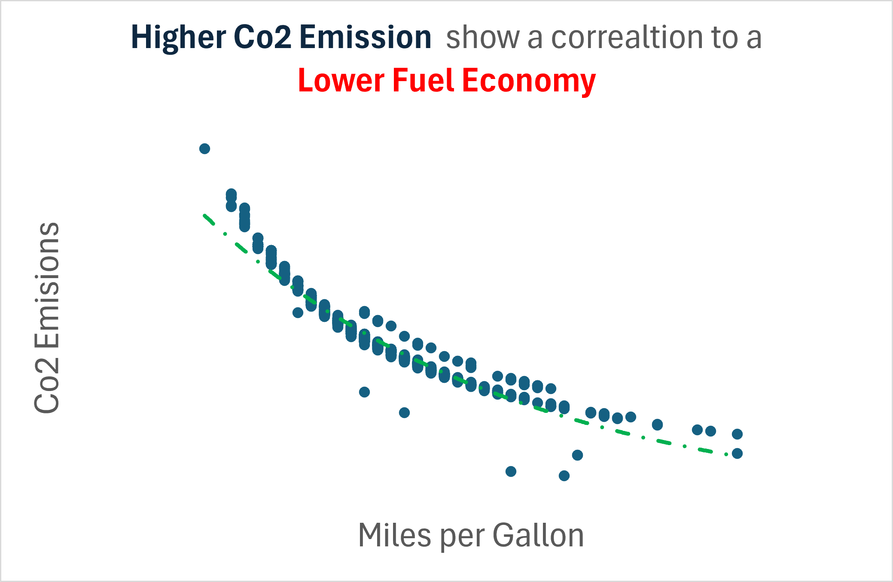

# Carbon Emissions EDA

## Project Overview

Vehicle emissions are a major contributor to greenhouse gas emissions. Understanding the factors associated with higher Co2 emissions can help identify trends in vehicle efficiency and the impact vehicles have on the environment.

This project uses SQL to explore the Co2 emissions of Vehicles between 2015 and 2025 and how they vary across manufacturer, model, Year, and engine specifications. It compares emissions across four fuel types (Premium, Midgrade, Regular, Diesel). This analysis also examines the relationship between fuel economy(MPG) and emissions, & if there are any changes in emission trends over time.

The purpose of this analysis is to identify key factors that are associated with vehicle emissions and generate insights that could support further research into vehicle efficiency and reducing emissions.

## Data Overview

The dataset used contains information on internal combustion engine (ICE) vehicles and their environmental performance. The dataset includes vehicle specifications, fuel type, fuel economy, and CO2 emissions.

Key metrics used in this analysis include:

Make (Manufacturer)

Model

Model Year

Fuel Type

Engine Size (L)

Engine Cylinders

Transmission Type

Combined MPG (Avg Mpg)

CO2 Emissions (grams per mile)

## Data Cleaning and Limitations

Prior to analysis, the dataset was reviewed for duplicate records, missing values, inconsistent manufacturer (Make) names, and invalid numerical values. No significant duplicate records were identified. Minor inconsistencies in manufacturer names (i.e., "MINI" to "Mini") were standardized. Fuel types and year values were validated against expected categories and ranges, and no invalid emissions or fuel economy values were detected. 

One possible data quality issue was identified with the manufacturer Subaru Tecnica International (STI), the performance division of Subaru. The model STI S209  was listed under  the manufacturer name "STI" rather than "Subaru."  Since external research revealed that STI models are distinct enough from Subaru, the entry is retained as is.

Records from the year 2026 were excluded in order to maintain consistency and minimise potential inaccuracies caused by incomplete year data.

A limitation of the dataset is that the data size for vehicle categories other than ICE (Gas) is small. Vehicle categories like CNG with only a single vehicle entry are not suitable for analysis.

## Research Questions

How do vehicle emissions vary across manufacturers and vehicle models?

How do emissions differ across fuel types?

How have vehicle emissions changed over time?

To what extent can fuel type explain differences in emissions and fuel economy among similar vehicles?

How do vehicle characteristics such as engine size, cylinder count, and transmission type relate to emissions?

What is the relationship between fuel economy (MPG) and CO2 emissions?

## Methodology

The dataset was filtered to include only internal combustion engine (ICE) vehicles. Analysis focused on comparing average Co2 emissions across manufacturers, vehicle models, and fuel types in order to identify emission patterns.

After observing differences in Co2 emissions between identical vehicle models, further analysis was conducted on vehicle models that use multiple fuel types within the same model year. This allowed for direct comparisons between fuel types while reducing the influence of differences in model specification.

Additional vehicle characteristics, like engine cylinders, engine size, and transmission type, were then explored to determine whether they could help explain observed differences in emissions and fuel economy (MPG) that could not be explained by fuel type alone.

Emission trends were then analysed across model years to identify changes over time and investigate whether there is a reduction in emissions over time.

## Key Findings

### 1. High-Emission Vehicle Models Are Primarily Performance and Utility Vehicles

Manufacturers that sell high-performance and luxury vehicles recorded the highest average CO2 emissions. However, many of these manufacturers were represented by relatively small sample sizes when compared to large-scale manufacturers such as  Ford and Chevrolet, suggesting that sample size should be considered when interpreting these results.

The highest-emitting vehicle models were performance-oriented sports cars and larger utility vehicles. This suggests that both vehicle performance requirements and vehicle size are associated with increased CO2 emissions.

### 2. Midgrade Gasoline Vehicles Consistently Record the Highest Average Emissions

Among the fuel types available in the dataset, Midgrade Gasoline vehicles showed the highest average CO2 emissions across the analysed time frame(2015-2025). They also show higher emissions when comparing identical vehicle models running different fuel types. 

CO2 emissions from diesel have gradually increased over the analysed timeframe (2015-2025), going from the lowest in 2015 to the 2nd highest in 2025.

### 3. Fuel Type Influences Emissions, but Does Not Fully Explain Them

Comparisons between identical vehicles available with multiple fuel options within the same model year revealed differences in both CO2 emissions and fuel economy. However, variations were also observed among vehicles sharing the same fuel type, suggesting that fuel type alone does not fully explain emission differences. It's worth noting that identical vehicle specifications from different manufacturers don't have the same fuel economy or emissions.

### 4. Vehicle Specifications Contribute to Emission Differences

Manufacturers, Engine size, engine cylinders, and transmission type were all associated with differences in emissions and MPG. The analysis suggests that no single vehicle characteristic determines emissions; instead, emissions appear to be influenced by a combination of factors, with larger engines leaning towards more emissions.

### 5. Higher Emissions Are Generally Associated with Lower Fuel Economy

Vehicles with higher average CO2 emissions generally tend to have lower MPG. Midgrade Gasoline vehicles, in particular, tended to combine relatively high emissions with lower fuel economy when compared to similar vehicles in the dataset.Diesel is a solid  example of this. Emissions for Diesel went from 349gpm in 2015 to 445gpm in 2025 and MPG went from the highest of the dataset 29.89mpg in 2015 to 22.89mpg in 2025  

## Conclusion
This analysis shows:

- Midgrade Gasoline vehicles recorded the highest average emissions when compared to vehicles of an identical year and specification.

- Co2 emissions from diesel have gradually increased over the analysed timeframe (2015-2025). The emissions from Premium and regular fuel have decreased over time.

- Emission patterns also vary across manufacturer specifications and over time, highlighting the complex factors that influence vehicle efficiency and Co2 emissions.

- Manufacturers that sell high-performance and luxury vehicles recorded the highest average CO2 emissions. However, many of these manufacturers were represented by relatively small sample sizes when compared to large-scale manufacturers.

- Fuel economy and emissions on average exhibit an inverse relationship. 

## Recommended Next Steps
- Investigate the impact of engine size, engine cylinder count, drivetrain, and transmission on vehicle emissions.

- Compare vehicles with identical specifications from different manufacturers to analyse fuel economy and emissions.

- Develop predictive models to estimate vehicle emissions using engine specifications and fuel economy metrics.

- Conduct a more detailed analysis of how fuel type and fuel economy interact to influence CO₂ emissions.

- Compare Fuel economy across ICE, hybrid, and electric vehicles.